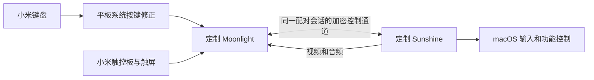

# Helper 收敛与外网输入评估

评估日期：2026-09-26。结论：可行，建议最终将客户端适配嵌入定制 Moonlight，将 Mac 事件后端嵌入定制 Sunshine，日常输入使用同一串流会话的加密控制通道。ADB 留作安装、调试工具。本轮完成评估与两个小改动，没有部署协议迁移或外网组网。

## 已验证能力与待做工作

当前鼠标、连续手势和键盘已由用户确认可用，因此主要工作是迁移已验证的输入逻辑、完善会话生命周期，而不是重新研究全部 Mac 手势。当前版本仍是官方 Moonlight 12.2 + Vector 模块 + ADB TLS + Helper 0.5.4，以及带光标捕获补丁的 Sunshine。

| 部分 | 建议去向 | 必须处理的边界 |
| --- | --- | --- |
| 本地光标、触控板识别、拖拽、双指轻触 | 定制 Moonlight Android | 保持本地绘制；位置与按钮顺序一致；切后台释放 |
| 普通键盘、按住重复 | 沿用 Moonlight/Sunshine 原有路径 | 保留修饰键、重复和断线释放，不占用快捷键作为协议 |
| 阶段滚动、惯性、Spaces/Mission Control、捏合 | Sunshine 的 macOS 输入模块 | 移植已实测的 CGEvent 语义，保留 macOS 15 兼容门槛 |
| Fn 亮度、音量、媒体等固定动作 | Sunshine | 复用 CoreAudio/系统媒体事件/现有 BetterDisplay 接口；慢动作不能阻塞输入线程 |
| 虚拟屏指针与触屏坐标 | Sunshine 会话的实际捕获显示器 | 下发视频区域、逻辑尺寸、初始光标位置和显示变更代次，保持黑边及 HiDPI 映射 |
| 小米系统抢键与 Fn 异常报告修正 | 平板系统模块 | 仍需 root/Vector，在安卓抢键前介入；扩展定制客户端包名 |
| ADB 读取器、文件心跳、临时 IP 发现 | 从日常输入路径移除 | 用串流连接建立/断开及协议协商接替 |
| UU 专用 Mos 适配 | 保留到 UU 回退需求结束 | 这是旧路径；Moonlight 的原生阶段滚动已能独立工作 |

目标运行关系：

平板只需连接 Moonlight 中选定的 Mac。Mac 不再反向寻找平板的 ADB 地址。外网或 VPN 承载改变时，增强输入与视频一起重连。

## 源码证据

本次重读的版本：Moonlight Android `b48494cb96bff23d8886c4775cc4f39a1075495d`、其 moonlight-common-c `874ac9548f1bd6f095ef2b435c42cdde460e7821`、Sunshine `63d35f702ee9e362e43263742981836ec0710384`。

- Android `simplejni.c` 已把 Java 输入调用交给共享 C 核心。新增专用输入入口需要同时维护 Java、JNI 和 moonlight-common-c，改 APK 界面本身不够。[JNI 源码](https://github.com/moonlight-stream/moonlight-android/blob/b48494cb96bff23d8886c4775cc4f39a1075495d/app/src/main/jni/moonlight-core/simplejni.c)
- `InputStream.c` 经 `sendInputPacketOnControlStream()` 进入控制流；已有 Sunshine 扩展消息和有界队列。触点移动允许合并，接触状态变化可靠发送，这可作为新扩展的设计依据。[输入发送](https://github.com/moonlight-stream/moonlight-common-c/blob/874ac9548f1bd6f095ef2b435c42cdde460e7821/src/InputStream.c)、[控制流](https://github.com/moonlight-stream/moonlight-common-c/blob/874ac9548f1bd6f095ef2b435c42cdde460e7821/src/ControlStream.c)
- Sunshine `stream.cpp` 已对加密控制消息验签解密，再交给 `input::passthrough()`；`input.cpp` 负责长度验证、队列、分发与释放。因此扩展可以依附现有已配对会话，不必新增对外监听服务。[控制流接收](https://github.com/LizardByte/Sunshine/blob/63d35f702ee9e362e43263742981836ec0710384/src/stream.cpp)、[输入分发](https://github.com/LizardByte/Sunshine/blob/63d35f702ee9e362e43263742981836ec0710384/src/input.cpp)
- Sunshine RTSP `DESCRIBE` 与客户端解析已有能力、加密协商入口。应新增明确版本的适配能力，双方同意后才发送扩展；现成触屏消息不具备 Mac 间接触控板的完整阶段语义。[RTSP 协商](https://github.com/LizardByte/Sunshine/blob/63d35f702ee9e362e43263742981836ec0710384/src/rtsp.cpp)

工程判断：收敛具有现成的传输与事件基础，工作量属于中等规模的双端适配，需要协议和实机回归；不能从“开源、已编译成功”直接推断只改几个开关就能完成。

## 方案比较与建议

| 方案 | 去掉日常 ADB | Mac 只保留 Sunshine | 评价 |
| --- | --- | --- | --- |
| 用 VPN 延长当前 ADB 通道 | 否 | 否 | 可作临时办法；平板无线调试、23333 规则和反向连接仍是运行依赖 |
| Moonlight 扩展进入 Sunshine，再由本机 IPC 调 Helper | 是 | 否 | 能较早验证外网输入，适合必要时过渡；增加的 IPC 应仅本机可用 |
| Moonlight 扩展进入 Sunshine，直接调用移入的输入模块 | 是 | 是 | 推荐的最终方案；接口收敛、运行组件最少 |

建议直接面向第三种组织代码，按功能逐步切换和验收；只有移植 Mac 后端明显拖慢外网验证时，才采用第二种过渡。一次会话只能由一个后端拥有同一种输入，避免双重点击、滚动与残留按键。

## 协议与迁移要点

1. 复用已有配对和加密通道。定义专用、带版本的输入扩展；字段沿用已验证的指针、按钮、滚动阶段、系统手势、缩放、固定 Fn 动作。开始阶段没有必要为了小流量重做加密或认证。
2. 上行消息带会话代次、序号和手势 ID。客户端连续位移可合并，按下/松开、开始/结束/取消可靠交付；不能跨这些边界合并。若采用可丢弃的更新包，需要累计位移/状态快照以恢复中间丢包，不能直接丢弃增量滚动后仍宣称完整。
3. 传输与 macOS 执行分开。高频输入使用有界队列；音量/亮度等动作在单独队列处理。断线、切后台、显示切换、客户端重启时结束惯性和手势并释放按钮、键盘状态。
4. 显示元数据从实际捕获对象获取，不依赖启动时缓存的主屏或现有 ADB 发布文件。显示发生变化时更新代次，旧坐标帧不作用到新屏。
5. Android 将当前纯 Java 手势、指针和光标代码移入客户端；移除该客户端对 Vector 输入 hook 的依赖。系统层抢键修正继续保留。
6. 定制 APK 使用独立包名和固定签名。官方 APK 签名不可由我们复用，保留原应用和数据，新客户端完成一次配对；系统键盘模块的目标包名同步扩展。[上游构建配置](https://github.com/moonlight-stream/moonlight-android/blob/b48494cb96bff23d8886c4775cc4f39a1075495d/app/build.gradle)
7. Sunshine 固定现有本地签名，迁入事件模块后核对辅助功能/录屏实际生效。当前原生手势仍是系统事件注入，不会因搬入 Sunshine 就变成完整 Apple 多点 HID 驱动。

验收顺序：先在局域网关闭无线 ADB 后验证全部输入；随后测试真实外部网络；再测试丢包/重连、按住按键时断线、横滑半程停止/反向、拖拽释放和内屏/虚拟屏切换。全部通过后停用 Helper 的 Moonlight 路径及固定 ADB 端口模块。UU 是否继续保留作为回退单独处理。

这些是后续实施方案，本轮没有修改路由器、端口转发、VPN 或当前传输协议。

## 外网可达性是另一个问题

ADB 协议本身不局限于同一网段，但本项目现有 `magisk/wifi-adb/service.sh` 只把 **wlan 接口上的 IPv4:23333** 转到原生 TLS 端口，并依赖无线调试启用。直接在两端安装 Tailscale，不会自动使这条规则适配 VPN 入站；因此不把它作为最终外网设计。

协议迁入串流会话后，增强功能可以使用 Moonlight 已建立的外网连接。真正连得上 Mac，仍需下列一种网络条件：

| 承载 | 条件与取舍 |
| --- | --- |
| Tailscale | 推荐先验证。Mac 与平板都在线，使用稳定的虚拟地址/域名；优先建立 direct 连接，不需要先向公网暴露 ADB。普通 Android 客户端占用 VPN 槽位，若同时使用其它 VPN 模式代理，需要另行安排。 |
| 公网 IPv4 + 端口映射/DDNS，或可达的 IPv6 | 可以不运行两端 VPN，但需要可控路由器/防火墙和真实可达地址；运营商 CGNAT、单位网络或入站过滤会限制这种方式。 |
| 中继/VPS | 两端都无法直连时可评估，但吞吐、额外 RTT 和带宽成本会影响高分辨率串流；不将公用中继“能连通”等同于“手感好”。 |

Moonlight 官方已有 Sunshine 外网和 Tailscale 配置说明；Tailscale 官方区分 direct、peer relay 与 DERP，后两者通常增加延迟，DERP 吞吐也可能更低。外网测试必须记录实际连接类型、RTT、抖动和丢包，不能承诺与局域网同样的延迟。[Moonlight 外网说明](https://github.com/moonlight-stream/moonlight-docs/wiki/Setup-Guide#streaming-over-the-internet)、[Tailscale 连接类型](https://tailscale.com/docs/reference/connection-types)、[Android VPN 限制](https://tailscale.com/docs/reference/faq/other-vpns)

本地光标移动可以继续保持即时反馈；远端窗口拖动、悬停响应以及视频变化仍受网络与编解码延迟约束。

## 光标形状同步

技术上可做：服务端检测形状变化，向客户端发送图像 ID、透明位图、热点和缩放信息；客户端缓存图像并保持本地位置驱动。形状变化才传图，不需要把每帧鼠标位置绕回服务端等待。

困难主要在 Mac 系统光标采集与跨版本兼容。`NSCursor.current` 只代表本应用；`currentSystemCursor` 可以返回全局光标，但 Apple 已将其列为不推荐接口，本机 SDK 还注明未来系统可能始终返回 nil。窗口缩放、拖拽、应用自定义及动画光标也需验证。ScreenCaptureKit 的 `showsCursor` 是控制是否合入视频，不等于现成的独立光标形状通道。[Apple NSCursor](https://developer.apple.com/documentation/appkit/nscursor)、[全局光标说明](https://developer.apple.com/documentation/appkit/nscursor/currentsystem)

因此先保留固定形状、将尺寸调整到原来的 65%；形状同步放在协议已有服务端回传能力之后，以 Mac 原型验证为门槛。本次不承诺所有光标形态已经实现。

## 本轮小调整

Moonlight 模块 0.2.5 首先将光标比例改为 0.8，用户反馈不明显，0.2.6 进一步改为 0.65，点击热点和坐标映射保持一致；双指短暂轻触并全部抬起发送一次右键按下/松开。长按、滚动、捏合、三指、实体按钮、取消和抬指间移动不会误转为右击。

状态机和构建/签名检查通过，用户已确认双指轻触右击正常。用户已确认 0.2.6 的更小光标合适。并发按键问题经同步采集定位为触点连接的底层上报暂停：按下键后原始触点帧中断，松键约 0.5 秒后恢复；应用保持焦点与捕获，未收到手势取消。用户确认蓝牙模式正常，当前可用蓝牙绕开；触点模式这一项尚未修复，当前已测边界和后续验证见 [触控并发记录](keyboard-pointer-concurrency.md)。Sunshine、Helper 和系统键盘版本保持本轮开始时的已验收版本。
