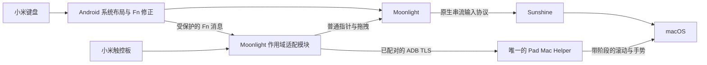

# Moonlight 输入适配第一版

这条路径与已验收的 UU 路径并存。分辨率和 BetterDisplay 配置不在本次改动范围内。

## 当前交付状态

| 组件 | 状态 |
| --- | --- |
| 官方 Moonlight 12.2 | 已安装，保留原第三方 Moonlight；已与本机 Sunshine 完成配对 |
| 官方 Sunshine 2026.914.233613 | 已安装并配置启动项，录屏和辅助功能已授权；已与官方 Moonlight 实际建立串流 |
| 系统键盘 1.9 | 已安装、完整重启，并核对 system_server 实际加载；原布局扩展到 Moonlight Game 页面 |
| Moonlight 输入模块 0.1.0 | 已安装、启用并限定官方包名，已核对实际加载；未连接 Mac 输入通道时保留 Moonlight 默认触控处理 |
| Pad Mac Helper 0.4.2 | 已安装并常驻，辅助功能有效；沿用本机现有开发证书，已移除临时验证事件路由 |
| 原 UU 基线 | UU 模块保持 0.11.2；已验收的系统键盘 1.8、Helper 0.3.0 安装产物保留用于回退 |

**自动回放不等于实体设备验收。** 连续切屏的半程保持、取消、完成和中途重新起手已在本机验证；Chrome 横滑返回仍未验收成功，通知滑走、真实触控手感和两种键盘连接方式仍待用户测试。具体步骤见 [手动测试清单](manual-input-checklist.md)。

## 输入如何流动



Moonlight 与 Sunshine 的官方二进制未修改。源码核对后，现阶段采用小范围 Vector 适配，避免承担整个视频客户端和服务端的分叉维护。触控扩展协议与传输分开，后续可换成串流协议扩展；当前扩展通道仍是 ADB TLS，不应描述成已全部走 Moonlight 协议。

官方 release 实测已内联 `NvConnection` 的部分包装方法，因此键盘状态记录和拖拽直接使用上游 keep 规则保留的 `MoonBridge` JNI 入口。模块加载时核对所需方法、字段，并严格限制版本为 12.2；不能只根据未优化源码假定发行 APK 仍保留每个 Java 方法。

同一个 Helper 内保留 UU 和 Moonlight 两个有界读取器；只有一个输入辅助 App 和一个输入辅助启动项。Sunshine 是串流服务，不是第二个滚动辅助程序。

## 行为与边界

- 原 Ctrl 为按住式 Fn，语音键为 Control，四叶草为 Option，Alt 为 Command。Fn 不发送到 Mac，不模拟 Globe。所有 Fn 功能目标均为 Mac；执行接口沿用已验收的固定动作。
- 普通键盘按下和松开由 Moonlight 传输，长按重复由 Sunshine 的服务端实现。没有新增定时打字器，也没有修改 Codex、终端或应用快捷键。
- 双指平移发送像素滚动及开始、改变、结束、取消、惯性阶段。方向不再用 Command/Option 加箭头模拟；抬手速度决定惯性，重新落指停止惯性。初始换算为每毫米 6 像素，惯性采用之前选择的强度 4，最终手感仍待实体测试。
- 双指改变间距发送独立的 magnify 事件，与横向滚动互斥。
- 三指直接滑动发送连续 Dock 手势，横向对应 Spaces，纵向对应 Mission Control / App Exposé；停留约 0.3 秒后移动则通过 Moonlight 左键拖拽。三指改变间距发送系统捏合手势。
- 四指使用相同导航逻辑，前提是 Android 实际上报四个触点。没有因为硬件“支持多点”就假定一定能收到四指。
- 输入距离按触控板自身的轴分辨率换算成毫米，不依赖平板屏幕 DPI。设备未提供分辨率时才使用明确的尺寸回退估算。
- Mac 原生手势使用私有 CoreGraphics 字段，仅在本机 macOS 15 上开放；它是系统手势注入，不是完整虚拟 Apple 多点 HID 设备。升级系统后需要重新核对。

## 防止残留输入

触点增加时重置原点，减少时结束已有操作，避免重心跳变；三指捏合不会调用鼠标按下。失焦、暂停、设备断开、输入通道失效都会取消手势并释放本模块持有的拖拽。拖拽连接已经关闭时，依赖 Sunshine 的会话释放逻辑。

键盘部分只在内存记录实际发送到 Moonlight 连接且尚未松开的键码，重复按下不会增加记录。失焦、暂停或设备移除时，按原协议标志补齐 KeyUp 并清除客户端临时修饰状态；不记录字符、输入历史，也不安装 Mac 键盘监听器。

Mac 的接收队列有背压，帧长度最多 4096 字节，超过 350 毫秒的旧输入不补执行。Dock 手势使用配对的开始、改变和结束/取消事件，不再延迟重发结束帧；每个合成事件填写单调时钟时间戳。触控扩展不模拟修饰键按下，因此不会用 Option 或 Command 当控制信号。

ADB 读取使用 `shell -T`，把标准输入的关闭作为进程生命周期信号。Helper 退出或连接断开后，平板端释放读取进程和 FIFO 锁；没有进入远控时安静等待，不因空闲持续重启 root 进程。已实测 Helper 被终止后旧读取器退出，新实例恢复连接。

## 构建、安装与启用

Android 沿用现有签名和最小 SDK：

```sh
python3 tools/fetch_android.py
python3 tools/build_android.py system-keyboard
python3 tools/build_android.py moonlight-input
python3 tools/deploy_android.py --serial '<设备地址>' --module system-keyboard
python3 tools/deploy_android.py --serial '<设备地址>' --module moonlight-input
```

首次安装新模块要在 Vector 启用 `local.pad.moonlight`，作用域只添加 `com.limelight/0`。不能回写整个 Vector 数据库。系统模块更新后重启平板；Moonlight 模块更新只需重启 Moonlight。安装必须禁用 incremental 和 streaming。

```sh
python3 tools/build_mac.py
python3 tools/install_mac.py
python3 tools/start_sunshine.py
```

本机固定签名身份保存在被忽略的 `.local/mac-signing-identity`，也可通过 `PAD_MAC_SIGN_IDENTITY` 指定。签名材料来自现有钥匙串，不提交仓库；没有身份配置时构建回退为临时签名，此时更新可能重新触发 TCC 授权。

首次在其他电脑安装需要在系统设置完成；本机下列授权已经完成：

1. Sunshine 的“录屏与系统录音”和“辅助功能”权限。
2. 安装后的 `~/Applications/Pad Mac Helper.app` 的“辅助功能”权限。新签名登记必须对应安装后的最终 App。
3. 重启 Sunshine 与 Helper，确认 `helper-status.json` 中权限为 true，并在 Moonlight 进入 Desktop 后检查 `moonlight_connection=connected`。

本机已使用安装目录中的最终 App 完成授权。后续更新沿用固定签名；不修改 TCC 数据库或系统安全设置。

## Sunshine 配置与网络

使用标准目录 `~/.config/sunshine`，配对、证书、主机身份和 Web 管理凭据持久保存。只提供 Desktop 入口，没有分辨率修改命令。UPnP 关闭，Web 管理界面限本机访问。

发布版本和下载摘要固定在 `tools/streaming-downloads.json`，已与 GitHub 官方 release 的摘要比对。管理凭据保存在本机忽略目录，不使用 Mac 或平板的登录密码。

当前按实际局域网地址配对，Moonlight 保留自己的主机发现能力。ADB 仍按设备序列号检查身份并支持配置地址或域名。Tailscale 可以作为后续传输承载，但当前未安装或启用 VPN，也未宣称固定端口转发已经适配 VPN 入站。

## 本次验证记录

2026-09-26 验证：

- 已通过此前的 Android 状态机、蓝牙 Fn 238 项、布局与协议检查，以及编译、签名、APK 安装、Vector 加载、加密配对和串流连接。
- 从蓝牙键盘接口回放按住字母、方向键、Backspace 各约 1.1 秒，Mac 隔离窗口分别收到 16、15、16 次按下及对应松开。Control、Option、Command 布局与全部释放正确；Option＋↑ 带正确修饰位，三个修饰键可以同时保持。Sunshine 重复事件没有原生 `isARepeat` 标记，因此只确认功能性重复，不能称为事件完全等同本机键盘。
- 从蓝牙触控接口回放，确认纵横像素滚动与惯性阶段、双指放大、三指停留拖拽的按下/移动/释放。自动轨迹不能判断实体触控起步、速度、惯性手感，也不能证明固件能报告真实四指。
- 回放已采集的蓝牙 Fn 位图序列，实际降低和提高 Mac 音量；结束后恢复原音量及静音。此次没有逐项触发亮度、睡眠、截屏等全部功能键。
- 向 Moonlight 扩展通道发送连续切屏帧，确认半程保持 3 秒、反向取消、完整提交，以及结束动画中重新起手后保持 3 秒；结束后恢复原桌面。此项验证 Mac 原生手势后端，没有经过真实手指采集。
- 终止 Helper 后，旧平板读取器退出，新 Helper 恢复连接。正式版本没有键盘监听器或测试专用事件转发。

未通过或未完成：Chrome 历史导航（已发送横向阶段，但页面仍未返回）、通知清除、纵向系统手势与 Launchpad 的实体操作、全部 Fn 位置、Bluetooth/Pogo 回归。Option＋↑ 在实际终端内的应用动作，以及 Control＋Option＋Command＋空格四分屏，需要用户亲自核对；自动测试只验证修饰位，没有修改应用快捷键。

切屏测试需要被控屏幕上至少两个桌面；本次没有创建、删除或移动用户的桌面。Sunshine 的 Mac 绝对鼠标定位针对主显示器，因此后续实测还要确认指针和所选虚拟屏幕对应。

交接时关闭临时测试窗口，移除输入探针、回放脚本、截图、原始事件记录和测试构建；平板亮屏超时恢复为原来的 60 秒。保留项目源码、最终构建、签名与配对资料、已验收回退包。正常模式不记录输入文字；Helper 只覆盖状态文件，Sunshine 使用低日志量配置。
